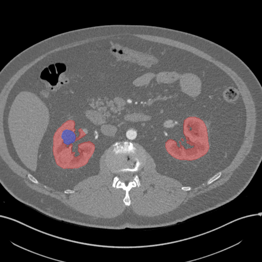
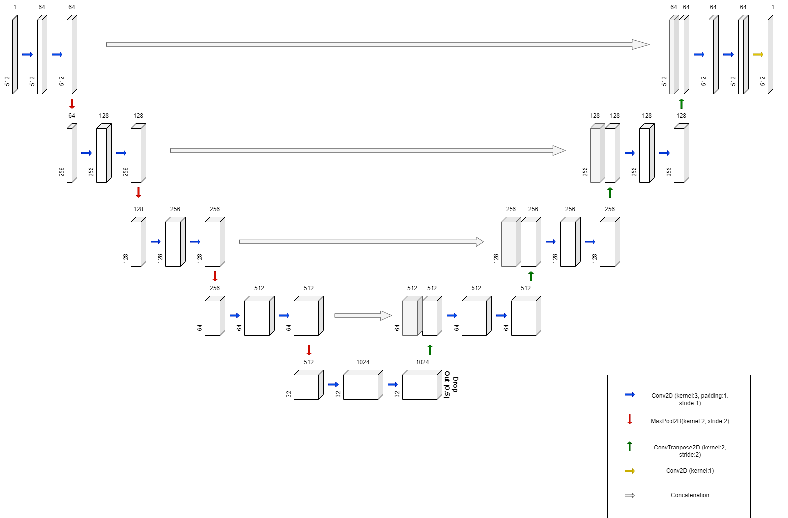
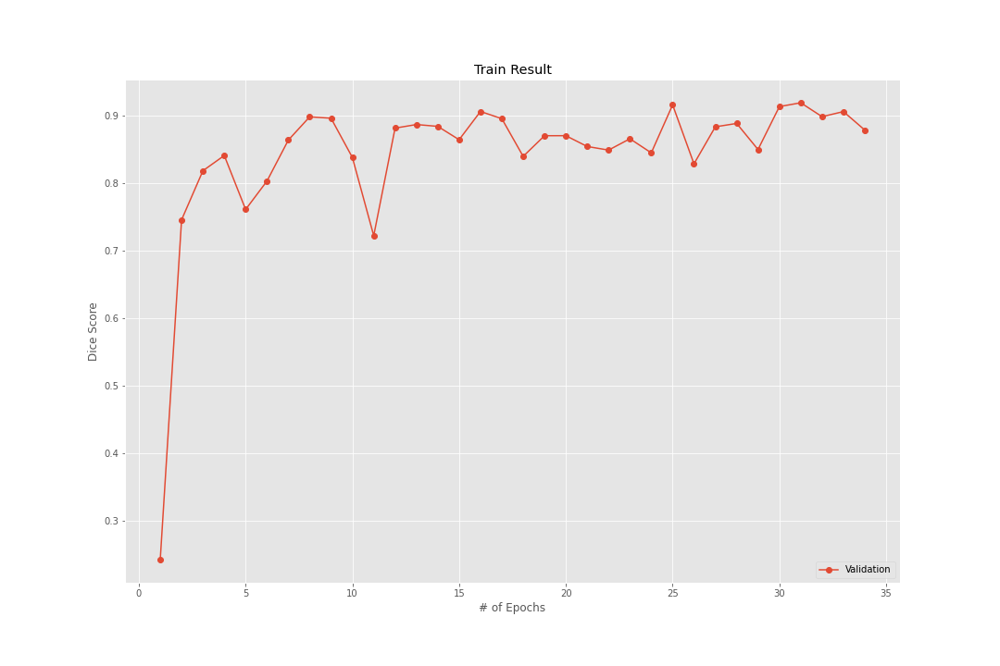
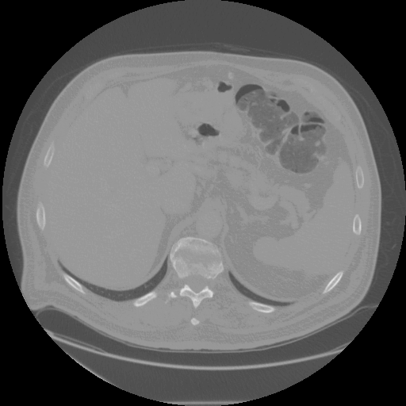
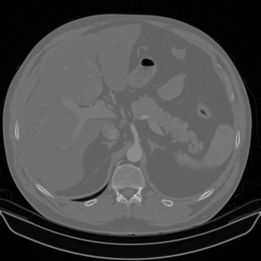
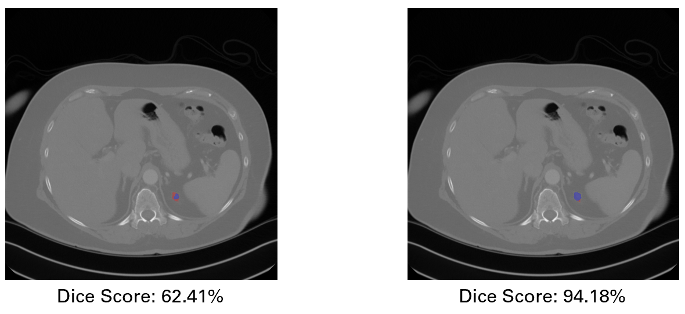

# **KiTS19** Challenge using ***U-net***
### Image segmentation task with **KiTS19** challenge data using **U-net**

You can find details about what this challenge is, and what Data are used, in this [Official Website](https://kits19.grand-challenge.org/).


Since Data are very big (about 27GB) you have to download it from [Official data source](https://github.com/neheller/kits19), where

you can find step-by-step procedure to download dataset.
- - -
## Objective

- The goal of the challenge is **kidney** and **kidney tumor** semantic segmentation.
- While our project aims to just **kidney** segmentation. But you can easily modify code to segment **kidney tumor** as well.

## Data Preview

(red represents kidney and blue represents tumor)

 In the segmentation, label 0 represents background, 1 represents kidney, and 2 represents tumor. But as I mentioned, sice we are interested in kidney segmentation, we replaced label 2 with 1.
 
 ## Model Structure
 
 For U-Net structure, we consulted [Official Paper](https://arxiv.org/abs/1505.04597). But we made slight changes.
 
 1. Batch Normalization after each Convolutional Layer
 2. Use padding in Convolutional Layer such that cropping isn't necessary while concatenation
 3. Drop out at the lowest part of network to avoid over-fitting
 4. Use different loss function, namely Generalized Dice Loss which was introduced in the paper [Generalised Dice overlap as a deep learning loss function for highly unbalanced segmentations](https://arxiv.org/abs/1707.03237)
 5. Not using data augmentation
 
 
 
 - Above all, adding Batch Normalization made great improvement in terms of dice score. Next, use padding at each Convolutional layer to avoid unnecessary 
 cropping also improved the segmentation result. Unlike the original U-net paper suggets, using data augmentation made training hard and even without
 data augmentation, just following above 5 changes was good enough for achieving good dice score.
 
 ## Train Result
 
 Using ```torch.optim.lr_scheduler.ReduceLROnPlateau``` with initial learning rate 0.0001, below is the train result.
 
 

- - -

## Inference
 
 We achieved ```95.35%``` Dice score on our best model.
 
 And below is the GIF image for the prediction of our model on validation data. 
 
               
 
 Red area represents Groun Truth and Blue area represents predicted kidney area by out best model. 
 
 - - -
 
 ## Code Structure & Explanation
 
 ### 0. Data download
 - Download the [data](https://github.com/neheller/kits19) and place the ```data``` folder, which contain folders like 'case_0000/', in the main project directory.
 
 ### 1. Data Preprocessing
 - Run ```make_data_npy.ipynb```. It will make ```data_npy``` folder and store preprocessed image as well as segmentation.
 
 ### 2. Training
 - Run ```main_train.py```. You can see the tqdm progress bar to see the progress of training.
 - The training result including model's ```state_dict``` and history will be saved on folder ```final_result```
 
 ### 3. Dice Score estimation on validation data
 - Run ```final_score_calculation.ipynb```. You can calculate the dice score on validation data set.
 - It automatically use the last trained model ```unet.pt```. So if you want to use best model, you have to change it manually.
 
 ### 4. Inference
 - Run ```make_pred_image.ipynb```. It will make ```pred_img``` folder and save inference image.
 - Like the above gif, red area represents ground truth and blue area represents model predicted kidney area.
 
 For those of you, who wants to see the final segmentation image right away, just go straight to ```step 4```. ```unet.pt``` inside the ```final_result``` is our final trained model.
 
 ## Additional
 
 ### Why using [Generalised Dice score](https://arxiv.org/abs/1707.03237) instead of just vanilla Dice score?
 
 
 
- As you can see from the above image, model trained using generalized dice loss (right image) is more capable of segmenting smallish area than using vanilla dice loss (left image). This is because, generalized dice loss take class imbalance in to account. Looking at the data, you can notice that, compared to background(the area except kidney), there is a small amount of kidney area. So using generalized dice loss improves the model's ability to properly segment kidney from background.
